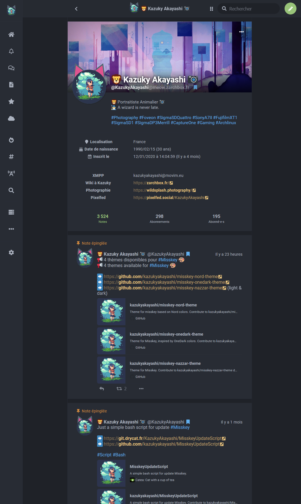

# Misskey OneDark theme

Theme inspired by [OneDark](https://github.com/joshdick/onedark.vim) colors.

# Use

Copy this code on misskey theme editor :

```
{
	id: 'OneDark',
	
	name: 'OneDark',
	author: 'KazukyAkayashi',
	desc: 'Dark theme',

	base: 'dark',

	props: {
	accent: '#98c379',
	bg: '#1f2228',
	fg: '#abb2bf',
	fgHighlighted: '#c678dd',
	panel: '#282c34',
	header: 'rgba(40, 44, 52, 0.75)',
	navBg: '#282c34',
	navFg: '@fg',
	navHoverFg: '#c678dd',
	navActive: '#c678dd',
	navIndicator: '@accent',
	link: '#e5c07b',
	mention: '#b48ead',
	hashtag: '#61afef',
	renote: '#56b6c2',
	pageBg: '@bg',
	badge:'#61afef',
	divider:'rgba(31, 34, 40, 0.7)',
	driveFolderBg:'@panel',
	},
}
```

# Screenshot 


